```mermaid
flowchart TB
    subgraph current["DotNetCoreApplication.csproj"]
        MAIN["<b>📦&nbsp;DotNetCoreApplication.csproj</b><br/><small>netcoreapp3.1</small>"]
        click MAIN "#dotnetcoreapplicationdotnetcoreapplicationcsproj"
    end

```

# Projects and dependencies analysis

This document provides a comprehensive overview of the projects and their dependencies in the context of upgrading to .NETCoreApp,Version=v10.0.

## Table of Contents

- [Executive Summary](#executive-Summary)
  - [Highlevel Metrics](#highlevel-metrics)
  - [Projects Compatibility](#projects-compatibility)
  - [Package Compatibility](#package-compatibility)
  - [API Compatibility](#api-compatibility)
- [Aggregate NuGet packages details](#aggregate-nuget-packages-details)
- [Top API Migration Challenges](#top-api-migration-challenges)
  - [Technologies and Features](#technologies-and-features)
  - [Most Frequent API Issues](#most-frequent-api-issues)
- [Projects Relationship Graph](#projects-relationship-graph)
- [Project Details](#project-details)

  - [DotNetCoreApplication\DotNetCoreApplication.csproj](#dotnetcoreapplicationdotnetcoreapplicationcsproj)

## Executive Summary

### Highlevel Metrics

| Metric | Count | Status |
| :--- | :---: | :--- |
| Total Projects | 1 | All require upgrade |
| Total NuGet Packages | 5 | 4 need upgrade |
| Total Code Files | 21 |  |
| Total Code Files with Incidents | 3 |  |
| Total Lines of Code | 788 |  |
| Total Number of Issues | 11 |  |
| Estimated LOC to modify | 6+ | at least 0.8% of codebase |

### Projects Compatibility

| Project | Target Framework | Difficulty | Package Issues | API Issues | Est. LOC Impact | Description |
| :--- | :---: | :---: | :---: | :---: | :---: | :--- |
| [DotNetCoreApplication\DotNetCoreApplication.csproj](#dotnetcoreapplicationdotnetcoreapplicationcsproj) | netcoreapp3.1 | 🟢 Low | 4 | 6 | 6+ | AspNetCore, Sdk Style = True |

### Package Compatibility

| Status | Count | Percentage |
| :--- | :---: | :---: |
| ✅ Compatible | 1 | 20.0% |
| ⚠️ Incompatible | 1 | 20.0% |
| 🔄 Upgrade Recommended | 3 | 60.0% |
| ***Total NuGet Packages*** | ***5*** | ***100%*** |

### API Compatibility

| Category | Count | Impact |
| :--- | :---: | :--- |
| 🔴 Binary Incompatible | 0 | High - Require code changes |
| 🟡 Source Incompatible | 5 | Medium - Needs re-compilation and potential conflicting API error fixing |
| 🔵 Behavioral change | 1 | Low - Behavioral changes that may require testing at runtime |
| ✅ Compatible | 1664 |  |
| ***Total APIs Analyzed*** | ***1670*** |  |

## Aggregate NuGet packages details

| Package | Current Version | Suggested Version | Projects | Description |
| :--- | :---: | :---: | :--- | :--- |
| Dapper | 2.0.35 |  | [DotNetCoreApplication.csproj](#dotnetcoreapplicationdotnetcoreapplicationcsproj) | ✅Compatible |
| Microsoft.EntityFrameworkCore.SqlServer | 3.1.8 | 10.0.2 | [DotNetCoreApplication.csproj](#dotnetcoreapplicationdotnetcoreapplicationcsproj) | NuGet package upgrade is recommended |
| Microsoft.EntityFrameworkCore.SqlServer.Design | 1.1.6 |  | [DotNetCoreApplication.csproj](#dotnetcoreapplicationdotnetcoreapplicationcsproj) | ⚠️NuGet package is deprecated |
| Microsoft.EntityFrameworkCore.Tools | 3.1.8 | 10.0.2 | [DotNetCoreApplication.csproj](#dotnetcoreapplicationdotnetcoreapplicationcsproj) | NuGet package upgrade is recommended |
| Microsoft.VisualStudio.Web.CodeGeneration.Design | 3.1.3 | 10.0.2 | [DotNetCoreApplication.csproj](#dotnetcoreapplicationdotnetcoreapplicationcsproj) | NuGet package upgrade is recommended |

## Top API Migration Challenges

### Technologies and Features

| Technology | Issues | Percentage | Migration Path |
| :--- | :---: | :---: | :--- |

### Most Frequent API Issues

| API | Count | Percentage | Category |
| :--- | :---: | :---: | :--- |
| T:Microsoft.AspNetCore.Hosting.IHostingEnvironment | 5 | 83.3% | Source Incompatible |
| M:Microsoft.AspNetCore.Builder.ExceptionHandlerExtensions.UseExceptionHandler(Microsoft.AspNetCore.Builder.IApplicationBuilder,System.String) | 1 | 16.7% | Behavioral Change |

## Projects Relationship Graph

Legend:
📦 SDK-style project
⚙️ Classic project

```mermaid
flowchart LR
    P1["<b>📦&nbsp;DotNetCoreApplication.csproj</b><br/><small>netcoreapp3.1</small>"]
    click P1 "#dotnetcoreapplicationdotnetcoreapplicationcsproj"

```

## Project Details

### DotNetCoreApplication\DotNetCoreApplication.csproj

#### Project Info

- **Current Target Framework:** netcoreapp3.1
- **Proposed Target Framework:** net10.0
- **SDK-style**: True
- **Project Kind:** AspNetCore
- **Dependencies**: 0
- **Dependants**: 0
- **Number of Files**: 27
- **Number of Files with Incidents**: 3
- **Lines of Code**: 788
- **Estimated LOC to modify**: 6+ (at least 0.8% of the project)

#### Dependency Graph

Legend:
📦 SDK-style project
⚙️ Classic project

### API Compatibility

| Category | Count | Impact |
| :--- | :---: | :--- |
| 🔴 Binary Incompatible | 0 | High - Require code changes |
| 🟡 Source Incompatible | 5 | Medium - Needs re-compilation and potential conflicting API error fixing |
| 🔵 Behavioral change | 1 | Low - Behavioral changes that may require testing at runtime |
| ✅ Compatible | 1664 |  |
| ***Total APIs Analyzed*** | ***1670*** |  |

